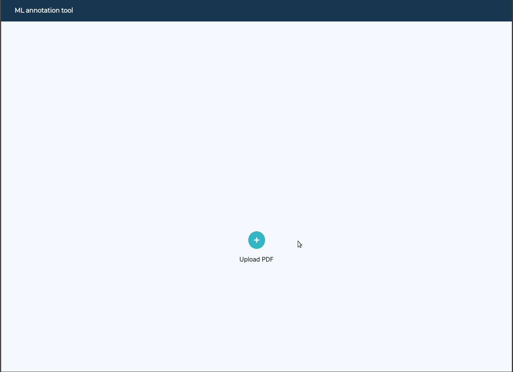
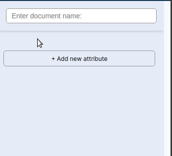
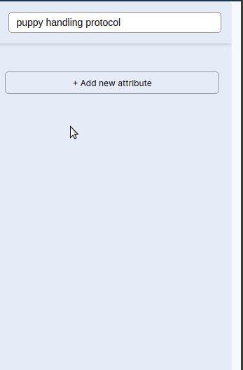
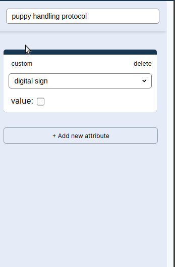
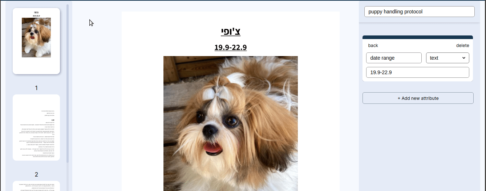
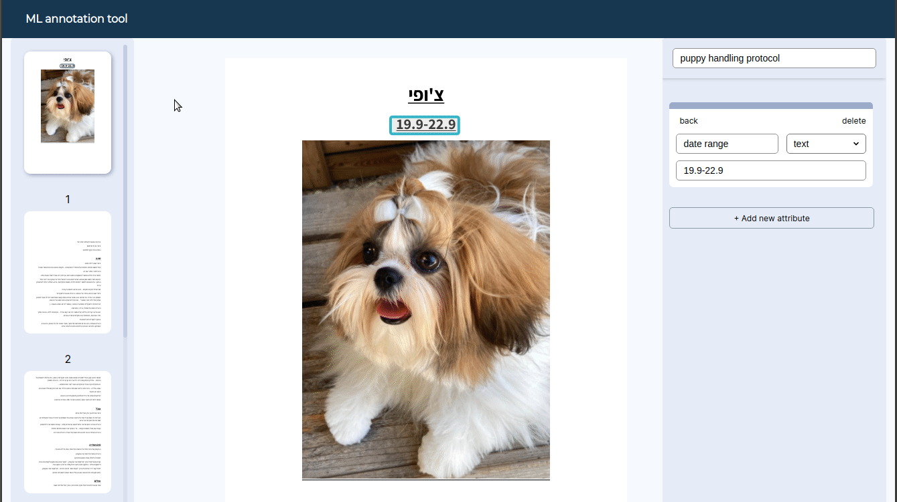

# A machine learning annotation tool - UI only

## 1. upload file

upload a .PDF file by clicking on the screen or by 'drag-and-drop'
 
_can handle a single multi-page document_
 

## 2. add document name

## 3. add a field

tag the document with either a default field:
 

 
or a custom field
 

## 4. set field location

 

## 5. navigate between fields

dbl-click rectangle to select active field
dbl-click card to select active field and change page view

